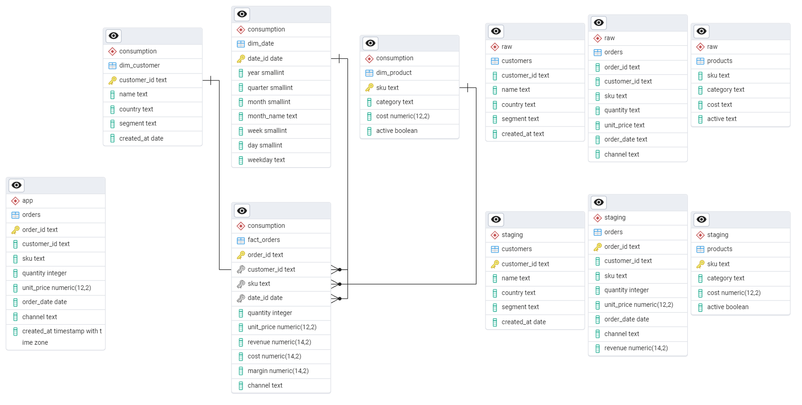

# RoseAmor — Prueba Técnica Full Stack de Datos

## Stack utilizado
- **Base de datos**: PostgreSQL 
- **ETL**: Python + pandas + psycopg2
- **App web**: Flask
- **BI**: PowerBI

---

## Arquitectura / Flujo

```
csv -> raw -> staging -> consumption -> DB-roseamor

DB-roseamor -> Power BI

DB-roseamor -> AppWeb(flask)

```

Se eligió un esquema de tres capas porque cada una tiene un propósito distinto:
- **raw**: permite auditar exactamente qué llegó en el CSV y re-procesar si cambia la lógica de limpieza.
- **staging**: separa la transformación de la carga; si falla una regla de negocio se puede corregir aquí sin tocar raw.
- **consumption**: modelo dimensional optimizado para consultas analíticas.
Se calcula revenue y margin una sola vez aquí para no recalcularlos en cada consulta del BI

## Limpieza
```
Fechas imposibles     2025-13-40           se filtraron
```
```
Pedidos duplicados    15 order_id iguales  se quedó el más reciente
```
```
Precios vacíos        10 filas sin precio  se excluyeron
```
```
Cantidades negativas  8 filas con qty<=0   se excluyeron
```
```
País/segmento nulos   5 clientes           se imputaron como 'Unknown'
```
```
Categoría nula        2 productos          se imputaron como 'Uncategorized'
```


---


## Modelo de datos



- **modelo estrella**: fact_orders es la tabla central de la estrella, mientras que las dimensiones son dim_customer, dim_date, dim_product.

La estructura se organiza así porque cada orden está asociada a un cliente, un producto y una fecha, lo que permite analizar fácilmente las ventas desde diferentes perspectivas.
- **La tabla app.orders**: Es para el aplicativo web y evitar conflictos a futuro.

---
## Consultas SQL — kpis.sql

El archivo `sql/kpis.sql` contiene todas las consultas que alimentan el dashboard.
**Para ejecutarlas:**
1. Abrir pgAdmin
2. Click derecho en la base de datos `roseamor` → Query Tool
3. Abrir el archivo `sql/kpis.sql`
4. Ejecutar con F5

## Cómo ejecutar

### Requisitos
- Python 3.11+
- PostgreSQL 

### Pasos

```bash
# 1. Clonar el repositorio
git clone <url>
cd roseamor

# 2. Instalar dependencias
pip install -r requirements.txt

# 3. Crear base de datos
psql -U postgres -c "CREATE DATABASE roseamor;"

# 4. Configurar variables de entorno
.env
# Editar .env con tus credenciales 
DB_HOST=
DB_PORT=
DB_NAME=
DB_USER=
DB_PASSWORD=


# 5. Ejecutar el ETL
python etl.py

# 6. Ejecutar kpis.sql
El archivo `sql/kpis.sql` contiene todas las consultas que alimentan el dashboard.
Para ejecutarlas:
Abrir pgAdmin
Click derecho en la base de datos `roseamor` ->  Query Tool
Abrir el archivo `sql/kpis.sql`
Ejecutar con F5

# 7. Ejecutar app web
cd app
python app.py
#  http://localhost:5000
```

## Cómo actualizar

Cuando llegue un nuevo CSV:

1. Reemplazar el archivo en `data/raw/` con la versión nueva.
2. Ejecutar nuevamente el flujo de trabajo.
3. Los pedidos en `app.orders` **no se tocan** porque están en un schema separado.

---

## Dashboard BI
Archivo:`document/RoseAmor_Dashboard.pbix`

---

## App web

- URL local: `http://localhost:5000`
- Endpoint POST: `POST /orders`
- Endpoint GET: `GET /orders` 
- Los pedidos quedan en la tabla `app.orders` de PostgreSQL
- Validaciones: campos obligatorios, quantity > 0, unit_price >= 0, formato de fecha YYYY-MM-DD, canal dentro de los 4 valores válidos, order_id único
